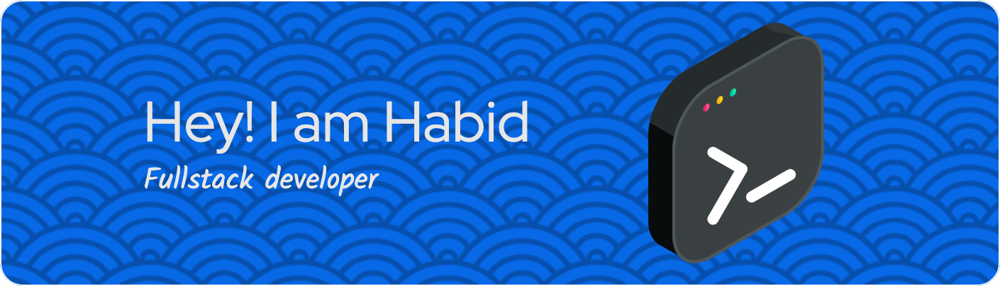

### _Passionate about tackling complex challenges. Highly motivated to apply my previous experiences to new tasks and to further develop my knowledge and technical skills within an innovative team. Focused on deepening my understanding of MERN technologies (MongoDB, Express.js, React, Node.js) and committed to continuous learning and improvement in the dynamic field of software development._

## 👨🏻‍💻 TOOLS AND TECHNOLOGIES

## 🔗 Links

---

## 📈 SUMMARY

<!--  -->

Header image generated by: _[Github
Profile Header Generator](https://leviarista.github.io/github-profile-header-generator/)_
